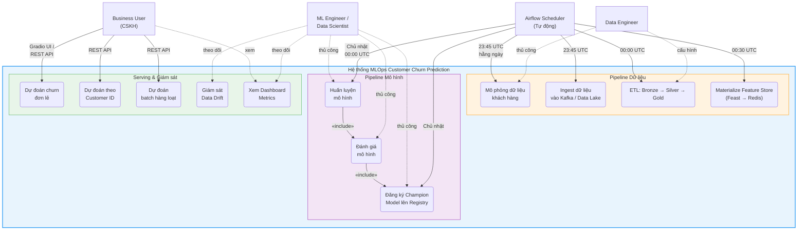
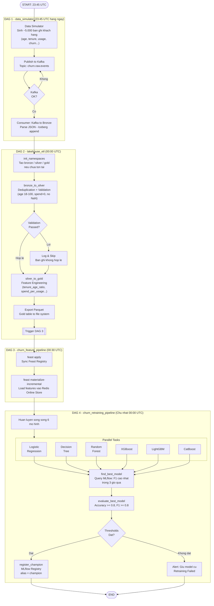
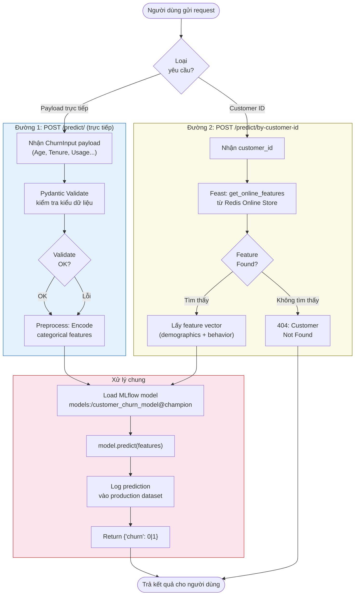
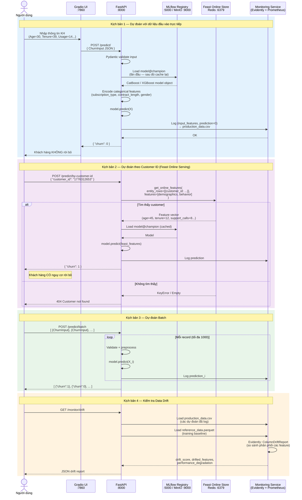
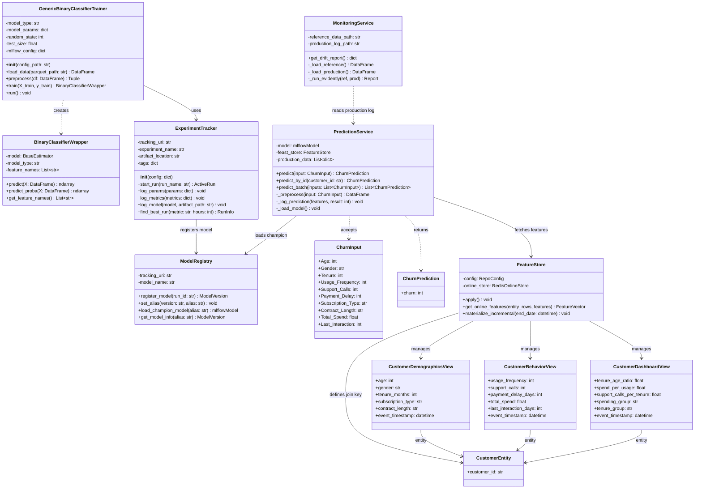
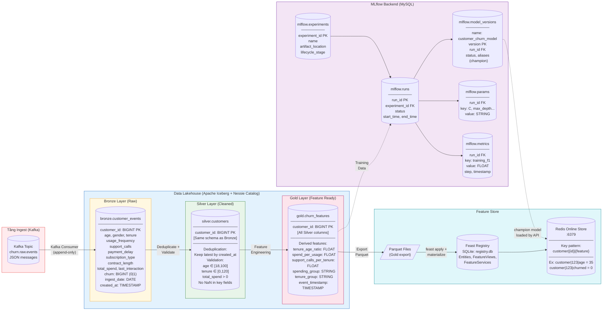
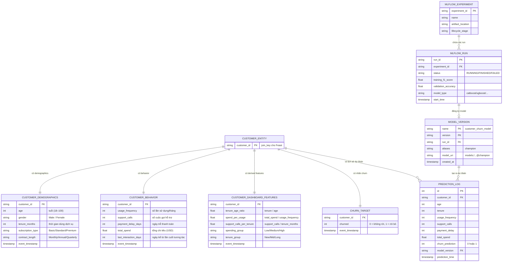

# Biểu đồ UML - Hệ thống MLOps Dự đoán Khách hàng Rời bỏ (Customer Churn Prediction)

> **Hướng dẫn xuất ảnh:** Copy từng khối code Mermaid vào **https://mermaid.live** → Export PNG/SVG để chèn vào báo cáo.

---

## 1.3 Biểu đồ Trường hợp Sử dụng (Use Case Diagram)



---

## 1.4 Biểu đồ Hoạt động (Activity Diagram)

### 1.4.1 Pipeline Hàng ngày & Tái huấn luyện



### 1.4.2 Luồng Xử lý Yêu cầu Dự đoán



---

## 1.5 Biểu đồ Trình tự (Sequence Diagram)



---

## 1.6 Biểu đồ Lớp (Class Diagram)



---

## 1.7 Biểu đồ Luồng Dữ liệu / Database Diagram



---

## 1.8 Biểu đồ Mối quan hệ Dữ liệu (Entity Relationship Diagram)



---

## 1.9 Thiết kế Giao diện (UI Design)

### Giao diện 1 — Gradio UI: Customer Churn Prediction (`:7860`)

```
┌─────────────────────────────────────────────────────────────────────┐
│  🤖  Customer Churn Prediction System                               │
│  Powered by MLflow Champion Model + Feast Feature Store             │
├──────────────────────────────────┬──────────────────────────────────┤
│  📋 THÔNG TIN KHÁCH HÀNG         │  📊 KẾT QUẢ DỰ ĐOÁN             │
│                                  │                                  │
│  Tuổi (Age):  [    30    ]       │  ┌────────────────────────────┐  │
│  Giới tính:   [ Male  ▼  ]       │  │                            │  │
│  Thời gian    [    39    ]       │  │   ✅  KHÔNG RỜI BỎ         │  │
│  dùng dịch vụ (tháng)            │  │     Churn = 0              │  │
│                                  │  │                            │  │
│  Tần suất sử dụng:  [   14  ]   │  │   Xác suất rời bỏ: 23%    │  │
│  Số cuộc gọi hỗ trợ:[    5  ]  │  └────────────────────────────┘  │
│  Ngày trễ thanh toán:[   18  ]  │                                  │
│  Loại gói:  [ Standard   ▼  ]   │  📋 Chi tiết Feature:            │
│  Loại HĐ:   [ Annual     ▼  ]   │  • tenure_age_ratio: 1.30        │
│  Tổng chi tiêu: [   932.0  ]    │  • spend_per_usage:  66.57       │
│  Ngày cuối TT:  [    17    ]    │  • spending_group:   High         │
│                                  │  • tenure_group:    Mid           │
│  ┌─────────────┐  ┌──────────┐  │                                  │
│  │  DỰ ĐOÁN   │  │ XÓA       │  │                                  │
│  │  NGAY       │  │ FORM     │  │                                  │
│  └─────────────┘  └──────────┘  │                                  │
├──────────────────────────────────┴──────────────────────────────────┤
│  ─── HOẶC: DỰ ĐOÁN THEO CUSTOMER ID ───                            │
│  Customer ID:  [  1776312653  ]        [ TÌM KIẾM & DỰ ĐOÁN ]      │
│                                                                     │
│  ─── DỰ ĐOÁN HÀNG LOẠT (Batch) ───                                 │
│  Upload CSV:   [ Chọn file... ]        [ BATCH PREDICT ]            │
└─────────────────────────────────────────────────────────────────────┘
```

### Giao diện 2 — FastAPI Swagger UI: REST API Documentation (`:8000/docs`)

```
┌─────────────────────────────────────────────────────────────────────┐
│  Customer Churn Prediction API                     OpenAPI 3.1      │
│  FastAPI | MLflow Champion Model | Feast Feature Store              │
├─────────────────────────────────────────────────────────────────────┤
│  PREDICT                                                            │
│  ├─ POST  /predict/              Dự đoán với payload đầy đủ         │
│  ├─ POST  /predict/by-customer-id  Dự đoán theo Customer ID         │
│  └─ POST  /predict/batch         Dự đoán hàng loạt (max 1000)      │
│                                                                     │
│  MONITOR                                                            │
│  └─ GET   /monitor/drift         Evidently data drift report        │
│                                                                     │
│  HEALTH                                                             │
│  ├─ GET   /health/               Model status + timestamp           │
│  └─ GET   /metrics               Prometheus metrics endpoint        │
├─────────────────────────────────────────────────────────────────────┤
│  Schemas                                                            │
│  ChurnInput  { Age, Gender, Tenure, Usage_Frequency,                │
│                Support_Calls, Payment_Delay, Subscription_Type,     │
│                Contract_Length, Total_Spend, Last_Interaction }     │
│  ChurnPrediction { churn: integer (0|1) }                           │
└─────────────────────────────────────────────────────────────────────┘
```

### Giao diện 3 — MLflow Experiment Tracking UI (`:5000`)

```
┌─────────────────────────────────────────────────────────────────────┐
│  MLflow Experiments                                   [+ New Exp]   │
├──────────────┬──────────────────────────────────────────────────────┤
│ Experiments  │  Experiment: churn_retraining_pipeline               │
│              │  ─────────────────────────────────────────────       │
│ ▶ churn_     │  Run Name        │ Model     │ F1    │ Accuracy       │
│   retraining │  run_catboost_   │ CatBoost  │ 0.867 │ 0.872  🏆      │
│   _pipeline  │  run_xgboost_    │ XGBoost   │ 0.854 │ 0.861          │
│ ▶ churn_     │  run_lgbm_       │ LightGBM  │ 0.848 │ 0.856          │
│   prediction │  run_rf_         │ RandomF.  │ 0.832 │ 0.841          │
│   _logistic  │  run_dt_         │ Dec.Tree  │ 0.791 │ 0.803          │
│              │  run_lr_         │ LogReg    │ 0.761 │ 0.775          │
│ Models       │                                                       │
│ ▶ customer_  │  Registered Model: customer_churn_model              │
│   churn_     │  Version 7 │ alias: champion │ CatBoost               │
│   model      │  Artifact: s3://mlflow/catboost/model.pkl            │
└──────────────┴──────────────────────────────────────────────────────┘
```

### Giao diện 4 — Airflow DAG UI (`:8080`)

```
┌─────────────────────────────────────────────────────────────────────┐
│  Apache Airflow 3.1.1                    [DAGs] [Grid] [Graph]       │
├─────────────────────────────────────────────────────────────────────┤
│  DAG: churn_retraining_pipeline           Schedule: 0 0 * * 0       │
│                                                                     │
│  ┌──────────────────────────────── Graph View ───────────────────┐  │
│  │                                                               │  │
│  │  [train_lr] ─┐                                               │  │
│  │  [train_dt] ─┤                                               │  │
│  │  [train_rf] ─┼──► [find_best_model] ──► [evaluate] ──► [reg] │  │
│  │  [train_xgb]─┤         ↑                                     │  │
│  │  [train_lgbm]┤    MLflow Query                               │  │
│  │  [train_cb] ─┘    (max F1, 3h)                              │  │
│  │                                                               │  │
│  └───────────────────────────────────────────────────────────────┘  │
│                                                                     │
│  DAGs                   Status    Schedule         Last Run         │
│  data_simulator         ✅ OK     0 23 45 * * *    2026-05-07       │
│  lakehouse_etl          ✅ OK     0 0 * * *         2026-05-07       │
│  churn_feature_pipeline ✅ OK     30 0 * * *        2026-05-07       │
│  churn_retraining_pipe  ✅ OK     0 0 * * 0         2026-05-05       │
└─────────────────────────────────────────────────────────────────────┘
```

### Giao diện 5 — Grafana Monitoring Dashboard (`:3000`)

```
┌─────────────────────────────────────────────────────────────────────┐
│  Grafana — Customer Churn MLOps Dashboard          [Last 24h ▼]     │
├──────────────────────┬──────────────────────┬───────────────────────┤
│  📈 Requests / min   │  ⏱️  Latency (p95)    │  ✅ Success Rate       │
│                      │                      │                       │
│   ▁▃▅▇▇▅▃▁▃▅▇▇▅▃▁  │        128 ms        │        99.2 %         │
│        42 req/min    │                      │                       │
├──────────────────────┴──────────────────────┴───────────────────────┤
│  🔴 Churn Predictions Today    │  📊 Prediction Distribution        │
│                                │                                    │
│   Total: 1,247                 │   Churn (1): ████████  62%         │
│   Churn: 773  (62%)            │   No Churn: █████      38%         │
│   No Churn: 474 (38%)          │                                    │
├────────────────────────────────┴────────────────────────────────────┤
│  ⚠️  Data Drift Monitor                                              │
│  Feature Drift Score: 0.031  ✅ Normal (threshold: 0.1)             │
│  Drifted features: None                                             │
│  Last check: 2026-05-07 06:00 UTC                                   │
├─────────────────────────────────────────────────────────────────────┤
│  📋 Airflow DAG Status (via StatsD)                                  │
│  data_simulator:         ✅ Last run: success  Duration: 2m 14s     │
│  lakehouse_etl:          ✅ Last run: success  Duration: 8m 32s     │
│  churn_feature_pipeline: ✅ Last run: success  Duration: 1m 05s     │
└─────────────────────────────────────────────────────────────────────┘
```

---

> **Lưu ý xuất ảnh cho báo cáo:**
> - **Mermaid diagrams (1.3 → 1.8):** Copy từng code block vào https://mermaid.live → Actions → Export PNG
> - **UI Mockups (1.9):** Chụp màn hình thực tế từ hệ thống đang chạy ở các port tương ứng, hoặc dùng ASCII art trên để minh họa
> - **PlantUML thay thế:** Nếu cần style UML chuẩn hơn, dùng https://plantuml.com/plantuml/uml/ với code PlantUML tương đương
